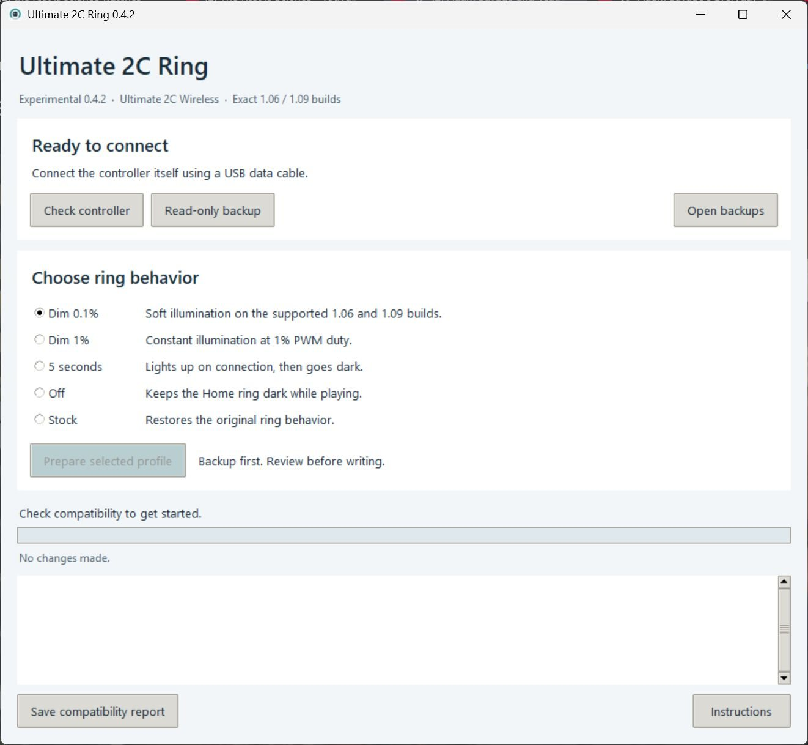

# Ultimate 2C Ring

I built this app to control the white Home-button ring on an **8BitDo Ultimate 2C Wireless** while keeping the controller running.



| Profile | Behavior while connected |
| --- | --- |
| Dim 0.1% | Soft illumination on the exact supported 1.06 and 1.09 builds |
| Dim 1% | Constant dim illumination, using 1% PWM duty |
| Timed | Normal illumination for approximately 5 seconds, then off |
| Off | Ring stays off |
| Stock | Restore the supported original application's ring behavior |

The change runs inside the controller. Once installed, no background program is needed on the PC. The power and mapping indicators keep their original handlers.

## Compatibility

**Experimental version 0.4.2.** I tested Stock, Dim 1% and Dim 0.1% on one Ultimate 2C Wireless with firmware 1.09. I also installed and fully verified Dim 0.1% on factory 1.06, with weak illumination and working controls. I confirmed Off and Timed on 1.06; I have only offline checks for these two profiles on 1.09. See my [validation record](docs/validation.md) for the checks of this desktop build. I have not tested a second controller.

- Model: **Ultimate 2C Wireless**, the version with a USB receiver.
- Tested host: **Windows 11**, **64-bit Python 3.12**.
- Firmware: the exact supported **factory 1.06 or stock 1.09 application build** listed in [the technical notes](docs/technical.md). This app changes ring behavior within the installed version; it does not upgrade or downgrade firmware.
- A USB **data cable connected to the controller itself** is required for backup and installation. The receiver is not modified.
- Not supported: Ultimate 2C Wired, Ultimate 2C Bluetooth for Switch, other Ultimate models, or unrecognized firmware builds.

The version number alone does **not** establish compatibility. The tool checks a SHA-256 fingerprint of the entire application region and refuses unrecognized images. A downloadable 1.06 release can differ from the supported factory 1.06 build. I have not independently tested different hardware revisions or other controller units. There is no `--force` option.

I publish source code and patch helpers. I do not distribute vendor firmware, device flash dumps, pairing data, or calibration data. Every target is generated from the connected controller's own memory.

## Quick start on Windows

### Ready-to-run application

1. Download the **Windows x64** ZIP for version 0.4.2 from [Releases](https://github.com/supercypok/ultimate2c-ring/releases/tag/v0.4.2-alpha).
2. Extract the **entire** ZIP. Keep `Ultimate2CRing.exe` beside its `_internal` folder.
3. Leave the receiver aside. Connect the controller itself with a USB data cable.
4. Open **Ultimate2CRing.exe**, then choose **Check controller**.
5. Choose a ring profile and click **Prepare selected profile**.
6. Wait for two complete reads and the verified disk backup. Review the prepared profile, then choose **Apply profile** or **Cancel**.
7. Keep the cable connected until full verification finishes. Check the ring, controls and vibration by cable and through the receiver.

Python does not need to be installed for the Windows package. Installation can take several minutes. The window stays responsive and blocks competing operations and closing during a write. Cancelling in the review window keeps the backup and writes nothing. Every installation rechecks the connected controller, even after a successful compatibility check.

Use **Save compatibility report** to create a report containing the application fingerprint and software versions. It excludes memory dumps, HID paths, serials, backup locations and local log messages. Saving does not send or upload anything.

The package is currently **unsigned**. Do not disable Windows security protections to run it; the source installation below is also available. The app does not request administrator privileges.

### Run from source

1. Download and extract the project source archive.
2. Install **Python 3.12, 64-bit** from [python.org](https://www.python.org/downloads/). Include the Python launcher or add Python to PATH.
3. Run **Setup.cmd** once. It creates a local Python environment and downloads the pinned HIDAPI dependency. Internet access is required for this step.
4. Leave the USB receiver aside and disconnect other 8BitDo controllers. Connect this controller directly with a USB data cable.
5. Run **Start.cmd**.
6. Choose **Check controller**. If the exact firmware build is supported, choose the ring profile you want.
7. Wait while the tool reads all **512 KiB twice**, saves and checks a private backup, and prepares the target. Review it, then choose **Apply profile** in the review window.
8. Leave the cable connected until full verification and normal USB identification finish.
9. Check the ring, buttons, sticks and vibration by cable and through the receiver. Also check that the ring turns off when you turn the controller off.

Installation can take several minutes because of the complete memory reads. Firmware writes can fail if the cable is unplugged or power is lost. The tool attempts to restore changed sectors after a write or verification failure, but cannot guarantee recovery from a disconnected or failed device. Keep the verified backup.

The dim profiles' **1% and 0.1% duty are not measured perceptual brightness or proven hardware minima**. I tested both settings on my controller, including Dim 0.1% on the supported 1.06 and 1.09 builds. I excluded the private 0.01% experiment from the selectable profiles because its light was too faint; the app recognizes it only to allow a return to a supported profile. The timed indication uses the existing approximately 200 ms LED tick, so the duration is approximate.

## Backups and privacy

By default, each operation creates its own folder under:

```text
%LOCALAPPDATA%\Ultimate2CRing\backups\
```

For an installation, the folder contains:

- `before.bin`: the exact complete memory image before the operation; verified by a second read.
- `stock-application-restored.bin`: a **derived** image with the supported stock application reconstructed. Its bootloader and settings come from that same current device; it is not a claim that the whole image is an untouched factory dump.
- `target-<profile>.bin`: the complete prepared target, built from that device's data.
- `journal.jsonl`: backup hashes, the write plan and verification results.

The separate **Read-only backup** button reads memory twice and leaves the device mode unchanged. Unsupported application builds may still be saved from the recognized bootloader, but cannot be patched.

Keep backup files private. They may contain pairing data and device-specific configuration. Do not attach them to public issues or upload them to a repository. Backups are stored outside the project by default; `.gitignore` also excludes flash dumps and local backup folders.

## Restore stock behavior or change profiles

Open the application and choose another profile or **Stock**. A new full backup is required and created each time. Current settings are preserved.

If the controller is already in recovery mode, the same tool can recognize its supported application from the full flash read and restore the stock application. It accepts only known complete application states. It is **not** a general rescue flasher for arbitrarily corrupted firmware.

### Enter recovery manually

I verified this sequence on my controller:

1. Unplug USB.
2. Hold Home until the controller is fully off, then release Home.
3. Hold **only L1 + R1**.
4. Plug the USB data cable into the controller while holding them.
5. Start the tool. The verified recovery device is `2DC8:3208`, named `8BitDo Boot`.

Do **not** add Home to the combination. If rollback fails, keep the controller connected in recovery mode and retain the operation's backup folder. Do not repeatedly try unrelated firmware files. If the tool reports an unknown application, stop and report the error without publishing a dump.

## Command-line use

Run these from the extracted project folder after Setup.cmd:

```powershell
.\.venv\Scripts\python.exe -m ultimate2c_ring status
.\.venv\Scripts\python.exe -m ultimate2c_ring backup
.\.venv\Scripts\python.exe -m ultimate2c_ring apply dim
.\.venv\Scripts\python.exe -m ultimate2c_ring apply ultradim
.\.venv\Scripts\python.exe -m ultimate2c_ring apply timed
.\.venv\Scripts\python.exe -m ultimate2c_ring apply off
.\.venv\Scripts\python.exe -m ultimate2c_ring restore
.\.venv\Scripts\python.exe -m ultimate2c_ring menu
```

The Windows package includes **Ultimate2CRingCLI.exe** for the same commands, for example `Ultimate2CRingCLI.exe status` and `Ultimate2CRingCLI.exe doctor`. The `doctor` command checks bundled HID and Tcl/Tk without opening the controller.

Offline validation never opens a device:

```powershell
.\.venv\Scripts\python.exe -m ultimate2c_ring preview dim --backup "C:\path\to\your\before.bin"
```

Use a private alternative backup folder with `--data-dir` **before** the command. `--yes` on apply/restore skips only the final typed confirmation; it does not skip backup, fingerprint checks or readback verification.

## Development and release

The firmware transformations are separate from USB access. Tests do not need a connected controller or HIDAPI installation:

```powershell
python -m unittest discover -s tests -v
```

See [CONTRIBUTING.md](CONTRIBUTING.md), [technical notes](docs/technical.md) and [validation status](docs/validation.md). The source archive can be uploaded as a GitHub release or the extracted source committed as a repository. Publish only project source files; exclude local environments, backups and firmware dumps.

GitHub Actions runs the safety tests on changes and pull requests, then builds a Windows package and checks its bundled dependencies. Workflows have read-only repository permissions; uploaded build artifacts are not automatically published as releases.

To build locally on Windows using Python 3.12 x64:

```powershell
python -m venv .build-env
.\.build-env\Scripts\python.exe -m pip install --only-binary=:all: -r requirements-build.txt
.\.build-env\Scripts\python.exe scripts/build_windows.py
```

The result is a Windows ZIP and SHA-256 checksum under `dist`. See [THIRD_PARTY_NOTICES.md](THIRD_PARTY_NOTICES.md) for bundled component licenses.

Original project code is MIT licensed. The license does not grant rights to 8BitDo firmware. HIDAPI is a separately installed dependency with its own license. I maintain this project independently and am not affiliated with 8BitDo or Telink.
